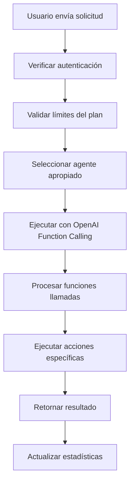

# 🤖 Sistema de Agentes de IA - Stack21

## 📋 Descripción General

El Sistema de Agentes de IA de Stack21 permite a los usuarios automatizar tareas complejas mediante agentes inteligentes especializados. Estos agentes pueden realizar acciones reales como reservas de restaurantes, creación de campañas de marketing, análisis de datos empresariales y mucho más.

## 🚀 Características Principales

### ✅ Funcionalidades Implementadas

#### 1. **Agentes Predefinidos**
- **Agente de Reservas de Restaurantes**: Busca, verifica disponibilidad y hace reservas
- **Agente de Marketing Automatizado**: Crea campañas y optimiza contenido
- **Agente de Análisis de Negocio**: Analiza datos y genera reportes

#### 2. **Sistema de Ejecución**
- Ejecución asíncrona de agentes
- Manejo de errores y estados
- Tracking de tokens y costos
- Historial completo de ejecuciones

#### 3. **Sistema de Límites**
- Control de ejecuciones por plan de suscripción
- Verificación de límites mensuales
- Alertas cuando se acerca al límite

#### 4. **Interfaz de Usuario**
- Chat interactivo con agentes
- Selección visual de agentes
- Historial de ejecuciones
- Estadísticas de uso

## 🏗️ Arquitectura Técnica

### **Componentes Principales**

```
src/
├── lib/
│   └── ai-agents.ts              # Lógica principal de agentes
├── app/
│   ├── api/
│   │   └── agents/
│   │       ├── route.ts          # API para ejecutar agentes
│   │       └── executions/
│   │           ├── route.ts      # API para obtener ejecuciones
│   │           └── [id]/route.ts # API para ejecución específica
│   └── agents/
│       ├── page.tsx              # Página principal de agentes
│       └── demo/
│           └── page.tsx          # Página de demostración
└── components/
    ├── ai-agent-interface.tsx    # Interfaz principal
    ├── agent-usage-stats.tsx     # Estadísticas de uso
    └── agent-demo.tsx            # Componente de demo
```

### **Flujo de Ejecución**



## 🎯 Agentes Disponibles

### 1. **Agente de Reservas de Restaurantes** 🍽️

**Capacidades:**
- `search_restaurants`: Buscar restaurantes por tipo de cocina y ubicación
- `check_availability`: Verificar disponibilidad de mesas
- `make_reservation`: Realizar reservas automáticamente

**Ejemplo de uso:**
```
"Reserva una mesa para 4 personas mañana a las 8pm en un restaurante italiano cerca de mi oficina"
```

### 2. **Agente de Marketing Automatizado** 📈

**Capacidades:**
- `create_marketing_campaign`: Crear campañas optimizadas
- `optimize_marketing_content`: Optimizar contenido por plataforma
- `schedule_social_posts`: Programar publicaciones

**Ejemplo de uso:**
```
"Crea una campaña de marketing para mi producto de fitness dirigida a jóvenes de 18-30 años"
```

### 3. **Agente de Análisis de Negocio** 📊

**Capacidades:**
- `analyze_sales_data`: Analizar datos de ventas
- `generate_business_report`: Generar reportes ejecutivos
- `predict_business_trends`: Predecir tendencias futuras

**Ejemplo de uso:**
```
"Analiza las ventas de mi tienda online esta semana y genera un reporte con insights"
```

## 💰 Sistema de Facturación

### **Planes y Límites**

| Plan | Precio | Ejecuciones/Mes | Agentes Disponibles |
|------|--------|-----------------|-------------------|
| **Free** | $0 | 10 | Básicos |
| **Pro** | $29 | 100 | Reservas + Marketing |
| **Enterprise** | $99 | Ilimitado | Todos + Personalizados |

### **Cálculo de Costos**

```typescript
// Costo aproximado por token
const costPerToken = {
  'gpt-4': 0.00003,      // $0.03 por 1000 tokens
  'gpt-3.5-turbo': 0.000002  // $0.002 por 1000 tokens
}
```

## 🔧 API Endpoints

### **GET /api/agents**
Obtener agentes disponibles
```typescript
Response: {
  success: true,
  data: {
    agents: AIAgent[],
    total: number
  }
}
```

### **POST /api/agents**
Ejecutar un agente
```typescript
Request: {
  agentId: string,
  input: string,
  context?: any
}

Response: {
  success: true,
  data: {
    execution: AgentExecution,
    agent: AIAgent
  }
}
```

### **GET /api/agents/executions**
Obtener historial de ejecuciones
```typescript
Query Params: {
  limit?: number,
  status?: 'pending' | 'running' | 'completed' | 'failed'
}

Response: {
  success: true,
  data: {
    executions: AgentExecution[],
    total: number
  }
}
```

## 🚀 Cómo Usar

### **1. Para Usuarios**

1. Ve a `/agents` en tu dashboard
2. Selecciona un agente de la lista
3. Escribe tu solicitud en lenguaje natural
4. El agente procesará tu solicitud automáticamente
5. Revisa el resultado en el historial

### **2. Para Desarrolladores**

#### **Crear un Nuevo Agente**

```typescript
const newAgent: AIAgent = {
  id: 'my-custom-agent',
  name: 'Mi Agente Personalizado',
  description: 'Descripción del agente',
  icon: '🤖',
  category: 'automation',
  isActive: true,
  capabilities: [
    {
      id: 'my-function',
      name: 'Mi Función',
      description: 'Descripción de la función',
      functionName: 'my_function',
      parameters: { param1: 'string' },
      requiredParams: ['param1'],
      optionalParams: []
    }
  ],
  config: {
    model: 'gpt-4',
    temperature: 0.7,
    maxTokens: 1000,
    systemPrompt: 'Eres un asistente especializado...',
    functionCalling: true,
    integrations: ['api1', 'api2']
  }
}
```

#### **Implementar Función de Agente**

```typescript
// En ai-agents.ts, agregar al switch en executeFunction
case 'my_function':
  return await this.myCustomFunction(params)

private async myCustomFunction(params: any): Promise<any> {
  // Implementar lógica de la función
  return { success: true, result: 'Función ejecutada' }
}
```

## 🔒 Seguridad y Límites

### **Validaciones Implementadas**
- ✅ Autenticación requerida
- ✅ Verificación de límites por plan
- ✅ Validación de entrada con Zod
- ✅ Manejo seguro de errores
- ✅ Rate limiting por usuario

### **Límites por Plan**
- **Free**: 10 ejecuciones/mes
- **Pro**: 100 ejecuciones/mes  
- **Enterprise**: Ilimitado

## 📊 Monitoreo y Analytics

### **Métricas Tracked**
- Ejecuciones por usuario
- Tiempo de ejecución
- Tokens utilizados
- Costos por ejecución
- Tasa de éxito/fallo

### **Alertas Automáticas**
- Límite del 75% alcanzado
- Límite del 90% alcanzado
- Errores de ejecución
- Costos inusuales

## 🛠️ Desarrollo y Testing

### **Ejecutar en Desarrollo**
```bash
# Iniciar servidor de desarrollo
npm run dev

# Visitar página de agentes
http://localhost:3000/agents

# Visitar demo
http://localhost:3000/agents/demo
```

### **Testing**
```bash
# Ejecutar tests
npm test

# Tests específicos de agentes
npm test -- --grep "agents"
```

## 🔮 Roadmap Futuro

### **Próximas Características**
- [ ] Agentes personalizados por usuario
- [ ] Integración con más APIs externas
- [ ] Agentes especializados por industria
- [ ] Sistema de plugins para agentes
- [ ] Analytics avanzados
- [ ] Agentes colaborativos

### **Integraciones Planificadas**
- [ ] OpenTable API (reservas reales)
- [ ] Facebook/Instagram Marketing API
- [ ] Google Ads API
- [ ] Salesforce API
- [ ] Shopify API
- [ ] Slack API

## 📞 Soporte

Para preguntas sobre el sistema de agentes:
- 📧 Email: support@stack21.com
- 💬 Discord: [Stack21 Community](https://discord.gg/stack21)
- 📚 Docs: [docs.stack21.com](https://docs.stack21.com)

---

**¡Los agentes de IA de Stack21 están listos para automatizar tu trabajo! 🚀**
